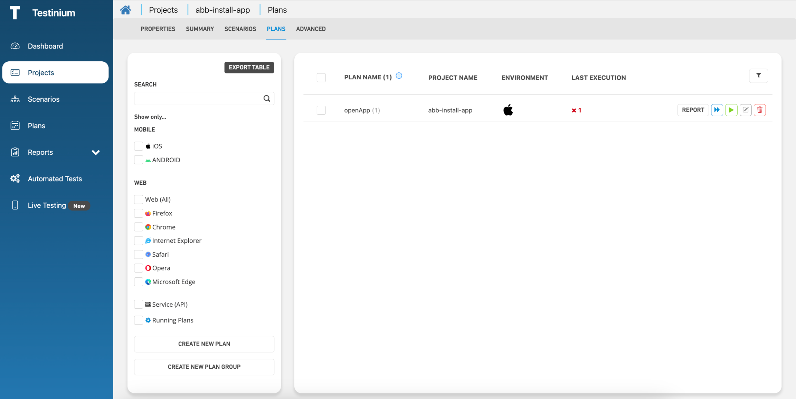
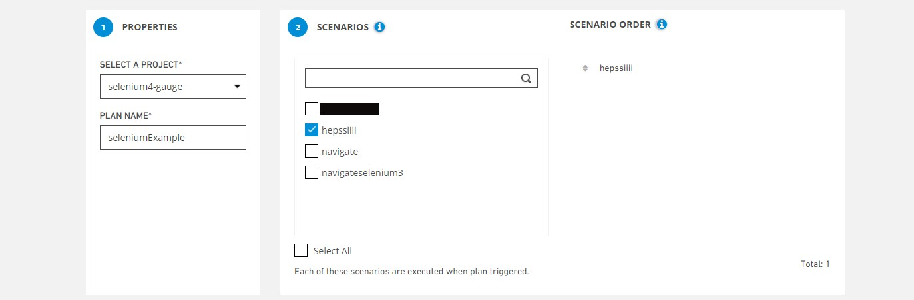

# Selenium Project

Testinium supports **Java**, **Gauge**, and **Cucumber** frameworks for Selenium projects.

### **Selenium-Gauge**

For projects created with **Selenium-Gauge**, the following requirements must be met:

* Projects created with Selenium-Gauge must include unique tags to ensure proper test execution and reporting.
* Test scenarios should be written under the **spec file** to maintain the proper structure.
* The versions must be correctly specified in the **pom.xml** file;

**Gauge**: 0.11.1

**Selenium**: 3.141.59

**Java**: 23

.png>)

* **manifest.json file** must contain **Xml Report Plugin.**

.png>)

* **.gitignore** file should be located in the project directory.
* **Target** folder should not be pushed to the remote repository.
* **Hub URL** must be specified for the remote driver to function properly (the hub address can be updated in the **BaseTest** class).

.png>)

### **Selenium-Java**

In projects created with **Selenium-Java**, the following requirements must be met:

* **.gitignore** file should be located in the project directory.
* **Target** folder should not be pushed to the remote repository.
* **Hub URL** must be specified for the remote driver to function properly.
* The versions must be correctly specified in the **pom.xml** file (Java version is **23**).

.png>)

### **Selenium-Cucumber**

In projects created with **Selenium-Cucumber**, the following requirements must be met:

* Feature files should be placed under the **src/resources** directory.

.png>)

* **.gitignore** file should be located in the project directory.
* **Target** folder should not be pushed to the remote repository.
* **Hub URL** must be specified for the remote driver to function properly.

.png>)

### Project Creation

To create a Selenium project, follow these steps:

#### **1. Project Name & Framework Selection**

* Enter a name for the project.
* Select the **Selenium framework** (e.g., _Java-Gauge-Cucumber_).
* Choose the appropriate file type for working with Selenium-Gauge.

#### **2. Project Configuration**

* The system indicates that the project will be created as a **Maven project by default**.
* The **Git repository link** for storing the project's source code is displayed.

#### **3. Project Creation & Source Code Management**

* Click the **Save** button to create the project in the system.
* After creation, the source code of the project must be pushed to the **provided Git repository link**.

Then, the source code of the project should be sent to the link address of the git repository given in the system.

### Scenario Creation

#### **1. Click the Create Button**

On the **All Scenarios** screen, click the **Create** button to begin the scenario creation process.

#### **2. Configure Scenario Properties**

In the scenario creation screen, configure the following fields:

* **Select a Project:** Choose the project for which you want to create a scenario.
* **Scenario Name:** Enter a unique name for the scenario.
* **Description:** Add comments or additional details about the scenario.
* **Group:** Organize multiple scenarios under a specific group.
* **Maximum Execution Time:** Define the maximum allowed execution time for the test. If the test exceeds this limit, it will be automatically aborted.

#### **3. Select Source File**

* The **Select Source File** section lists test files available in the repository.
* Choose the test file that contains the test methods you want to include in the scenario.

#### **4. Select Test Methods**

* This section displays the test methods from the selected test file.
* Select the test method(s) to be included in the scenario.
* **Create Scenario Group:** Allows selecting multiple test cases within a group.
* **Select All Option:** Use the "Select All" radio button to include all test cases at once.

**Character Validation in Scenario Creation**

During the scenario creation process, character validation is performed to ensure that only supported characters are used. The system allows characters within the **ASCII range of 32 to 127**, based on the [ASCII Table](https://www.asciitable.com/).

If a scenario contains characters outside this range, an error message will be displayed, and the scenario will not be accepted.

#### 5. File Content

* This screen displays the scenario steps from the spec file of the selected test method. It allows you to modify and save changes to the test steps within your scenario.

.png>)

#### 6. Set System Parameters

* In this section, you can define the necessary system parameters (optional). These parameters can be used in your test code, and Testinium will export them to the system where the tests will be executed.

.png>)

### Plan Creation

After completing the previous steps, a **plan** should be created for the project and the associated scenario.

* To create a new plan, navigate to the **"All Plans"** screen.
* Click the **Create** button to define a new plan for your project and scenario.

#### **1. Properties**

* **Select a Project:** Choose the project for which the plan will be created.
* **Plan Name:** Enter a name for the newly created plan.

#### **2. Scenarios**

* Scenarios from the selected project are listed.
* You can select multiple scenarios to include in the test plan.

#### **3. Scenario Order**

* Arrange the selected scenarios in the desired execution order.
* Scenarios will be executed sequentially based on the defined order.

***

#### **3. Platform Selection**

The Platform Selection step allows you to run your scenarios on the desired platform.

* **Operating System & Browser Selection:**
  * Choose an operating system (e.g., Windows 10).
  * Select a browser (e.g., Chrome) and specify the desired version (e.g., latest version).
  * Your test will be executed on the selected platform.
* **Screen Resolution Selection:**
  * Choose a preferred screen resolution from the available options.
  * Click the **Add** button to save your selections.
* **Managing Selected Configurations:**
  * The **selected operating system, environment name, environment version, and screen resolution** will be displayed on the screen.
  * Use the **Delete** button to remove any selected configurations.
  * You can reselect and add new configurations if needed.
* **Saving the Plan:**
  * Click the **Save** button to finalize your selections and create the plan.

.png>)

After completing these steps, the project, scenario, and plan will be successfully created in the Testinium, ready for execution.
